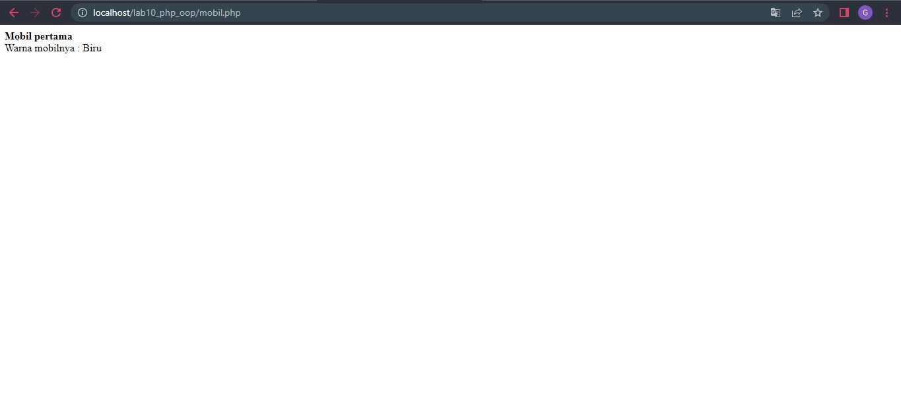
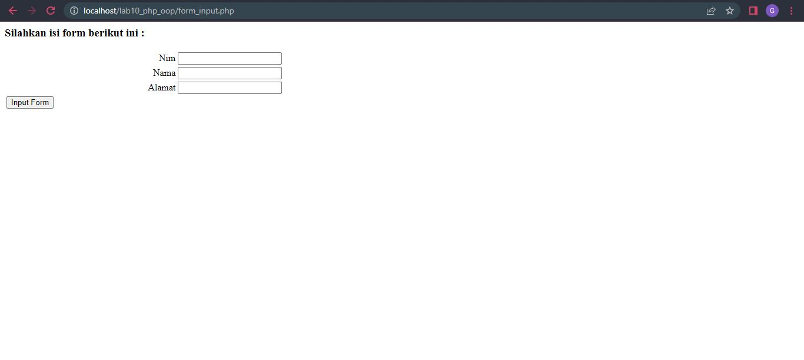

# Lab10web
## PHP OOP
OOP (Object Oriented Programming) adalah suatu metode
pemrograman yang berorientasi kepada objek.
Tujuan dari OOP diciptakan adalah untuk mempermudah pengembangan program dengan cara mengikuti model yang
telah ada di kehidupan sehari-hari.

### LAngkah-langkah Praktikum
### Membuat File mobil.php
Kode yang diinputkan sebagai berikut
```
<?php
/**
* Program sederhana pendefinisian class dan pemanggilan class.
**/
class Mobil
{
private $warna;
private $merk;
private $harga;
public function __construct()
{
$this->warna = "Biru";
$this->merk = "BMW";
$this->harga = "10000000";
}
public function gantiWarna ($warnaBaru)
{
$this->warna = $warnaBaru;
}
public function tampilWarna ()
{
echo "Warna mobilnya : " . $this->warna;
}
}
// membuat objek mobil
$a = new Mobil();
$b = new Mobil();
// memanggil objek
echo "<b>Mobil pertama</b><br>";
$a->tampilWarna();
echo "<br>Mobil pertama ganti warna<br>";
$a->gantiWarna("Merah");
$a->tampilWarna();
// memanggil objek
echo "<br><b>Mobil kedua</b><br>";
$b->gantiWarna("Hijau");
$b->tampilWarna();
?>
```
Kemudian untuk mengakses hasilnya melalui URL: http://localhost/lab10_php_oop/mobil.php
Ini adalah tampilannya

### Membuat File form.php
Kode yang diinputkan sebagai berikut
```
<?php
/**
* Nama Class: Form
* Deskripsi: CLass untuk membuat form inputan text sederhan
**/
class Form
{
private $fields = array();
private $action;
private $submit = "Submit Form";
private $jumField = 0;
public function __construct($action, $submit)
{
$this->action = $action;
$this->submit = $submit;
}
public function displayForm()
{
echo "<form action='".$this->action."' method='POST'>";
echo '<table width="100%" border="0">';
for ($j=0; $j<count($this->fields); $j++) {
echo "<tr><td

align='right'>".$this->fields[$j]['label']."</td>";
echo "<td><input type='text'
name='".$this->fields[$j]['name']."'></td></tr>";
}
echo "<tr><td colspan='2'>";
echo "<input type='submit' value='".$this->submit."'></td></tr>";
echo "</table>";
}
public function addField($name, $label)
{
$this->fields [$this->jumField]['name'] = $name;
$this->fields [$this->jumField]['label'] = $label;
$this->jumField ++;
}
}
?>
```
Kemudian untuk mengakses hasilnya melalui URL: http://localhost/lab10_php_oop/form.php
Ini adalah tampilannya

### Membuat File form_input.php
Kode yang diinputkan sebagai berikut
```
<?php
/**
* Program memanfaatkan Program 10.2 untuk membuat form inputan sederhana.
**/
include "form.php";
echo "<html><head><title>Mahasiswa</title></head><body>";
$form = new Form("","Input Form");
$form->addField("txtnim", "Nim");
$form->addField("txtnama", "Nama");
$form->addField("txtalamat", "Alamat");
echo "<h3>Silahkan isi form berikut ini :</h3>";
$form->displayForm();
echo "</body></html>";
?>
```
Kemudian untuk mengakses hasilnya melalui URL: http://localhost/lab10_php_oop/form_input.php
Ini adalah tampilannya
